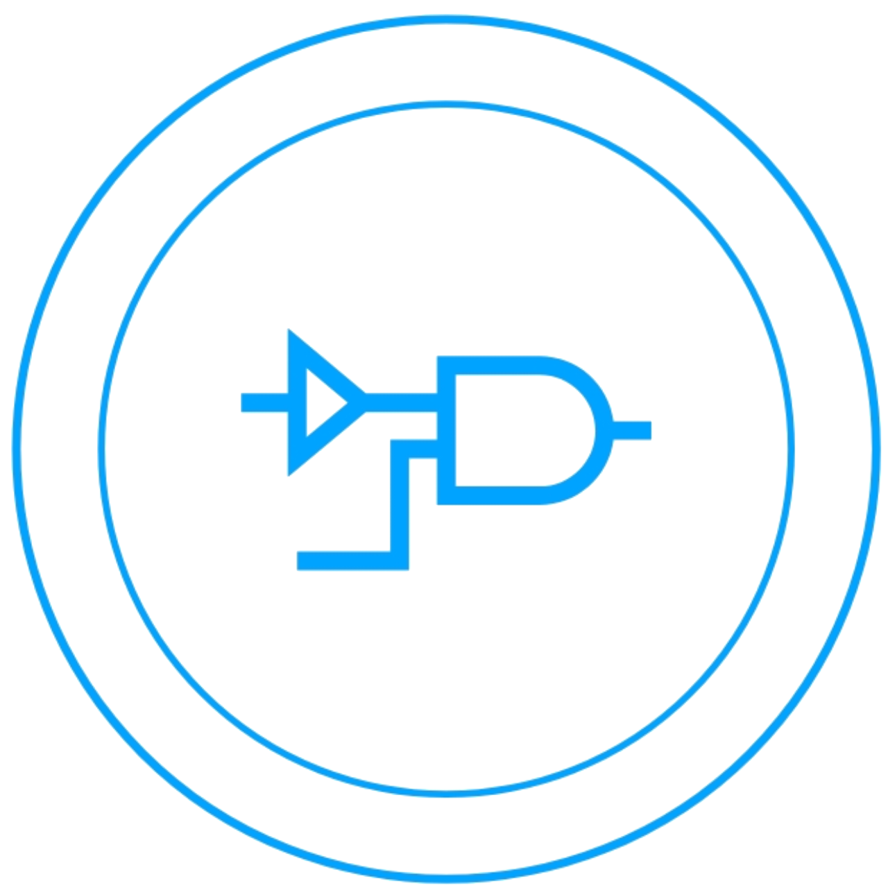

<p align="center">
    
    <h1 align="center">Logicalc</h1>
</p>


[](LICENSE-MIT)
[](LICENSE-CERN)
[](https://doi.org/10.5281/zenodo.XXXXXX)
[](https://github.com/jrnglo/Logicalc)


## 🧠 What is Logicalc?

Logicalc is an innovative educational mobile application designed to revolutionize how students learn digital logic concepts. By leveraging cutting-edge computer vision and graph algorithms, it provides seamless bidirectional conversions between fundamental logic gate representations:

- **Boolean Algebra Expressions ↔ Circuit Diagrams**  
  Instantly generate schematic diagrams from logic equations, or extract Boolean expressions from circuit images

- **Truth Tables ↔ Timing Diagrams**  
  Visualize signal behavior over time or generate comprehensive truth tables from either equations or diagrams

### Core Technology Integration
Logicalc combines state-of-the-art technologies to deliver accurate conversions:
1. **YOLOv9 Convolutional Neural Network**  
   - Real-time detection of logic gates in circuit diagrams
   - Precision: 97% | Recall: 95% | F1-Score: 96%
   - Trained on 4,532 annotated circuit images

2. **Sugiyama Graph Layout Algorithm**  
   - Hierarchical organization of circuit components
   - Minimizes edge crossings for optimal readability
   - Preserves logical flow from inputs to outputs

3. **Unified Processing Pipeline**  


## 𝌞 Table of Contents


- [🪁 What is Logicalc?](#-what-is-logicalc)
- [🎯 Features](#-key-features)
- [🚀 Deployment](#-deployment)
    * [💼 Software Requirements](#-software-requirements)
    * [📥 Downloading the Repository](#-downloading-the-repository)
    * [🏗️ Building from Source](#%EF%B8%8F-building-from-source)
- [💿 Firmware](#-firmware)
    * [⚡ Components](#-components)
    * [🔧 Hardware Setup](#-hardware-setup)
    * [📡 Uploading the Firmware](#-uploading-the-firmware)
- [🤝 Contributing and Contributors](#-contributing-and-contributors)
    * [🐞 Issue Reporting](#-issue-reporting)
    * [🛠️ Pull Requests](#-pull-requests)
    * [👥 Contributors](#-contributors)
- [📷 Screenshots](#-screenshots)
- [💙 Donating](#-donating)
- [⭐️ Star History](#-star-history)
- [📜 License](#-license)

## ✨ Key Features

### 🔄 Bidirectional Conversion
- **Equation → Diagram**: Generate circuit diagrams from Boolean expressions
- **Diagram → Equation**: Extract logic equations from circuit images
- **Truth Table ↔ Timing Diagram**: Visualize signal behavior over time

### 🧩 Supported Components
| Logic Gates | Connectors | Input/Output |
|-------------|------------|--------------|
| AND         | Junction   | Terminal     |
| OR          | Crossover  | Text Label   |
| NOT         | Wire       |              |
| NAND        |            |              |
| NOR         |            |              |
| XOR         |            |              |
| XNOR        |            |              |

### 📊 Performance Metrics
| Metric       | Initial | Final  | Improvement |
|--------------|---------|--------|-------------|
| **F1 Score** | 0.83    | 0.96   | +15.6%      |
| **Precision**| 0.85    | 0.97   | +14.1%      |
| **Recall**   | 0.80    | 0.95   | +18.7%      |
| **mAP@0.5** | 0.81    | 0.98   | +21.0%      |

## ⚙️ System Requirements

### 💻 Development Environment
```bash
# Hardware
- NVIDIA GPU (RTX 3080 recommended for training)
- Intel CPU (i3-7100T minimum requirement for development)
- 16GB RAM minimum (32GB recommended)

# Software
- Visual Studio Code (for development)
- Android Studio (for mobile deployment)
- Android Operating System (mobile application environment)
