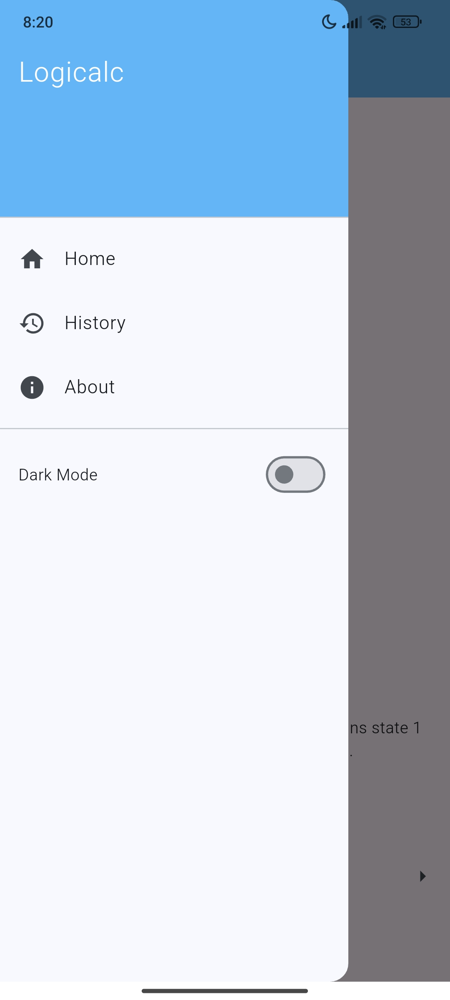

<p align="center">
    
    <h1 align="center">Logicalc</h1>
</p>


[](LICENSE-MIT)
[](LICENSE-CERN)

[](https://github.com/jrnglo/Logicalc)
[](https://github.com/jrnglo/Logicalc/issues)
[](https://github.com/jrnglo/Logicalc/stargazers)


## 🧠 What is Logicalc?

Logicalc is an innovative educational mobile application designed to revolutionize how students learn digital logic concepts. By leveraging cutting-edge computer vision and graph algorithms, it provides seamless bidirectional conversions between fundamental logic gate representations:

- **Boolean Algebra Expressions ↔ Circuit Diagrams**  
- **Truth Tables ↔ Timing Diagrams**  

### Core Technology
- **YOLOv9 CNN**: 97% precision logic gate detection
- **Sugiyama Algorithm**: Optimal circuit visualization
- **Unified Processing Pipeline**:  
  

---

### 1. Core Components
#### OR Gate Example
| **Symbol** | **Truth Table** | **Function** |
|------------|-----------------|--------------|
| `[+]`      | <table><tr><th>A</th><th>B</th><th>Y</th></tr><tr><td>0</td><td>0</td><td>0</td></tr><tr><td>0</td><td>1</td><td>1</td></tr><tr><td>1</td><td>0</td><td>1</td></tr><tr><td>1</td><td>1</td><td>1</td></tr></table> | Output (Y) is `1` if at least one input (A or B) is `1` |

*Supports all 7 logic gates: AND, OR, NOT, NAND, NOR, XOR, XNOR*

### 2. Navigation
- **Home**: Return to main screen
- **History**: View past calculations
- **About**: App information
- **Dark Mode**: Toggle dark/light theme

### 3. Conversion Tools
1. **Convert Equation** → Generate diagrams/tables from equations  
   `(A ∧ B) ⊙ C`
2. **Convert Schematic** → Extract equations from circuit images

### 4. Equation Input
```plaintext
1. Enter equation: (A ∧ B) ⊙ C
2. Use symbol palette:
   - AND: ∧ or @
   - OR: ∨ or +
   - NOT: ¬ or -
   - XOR: ⊕ 
   - XNOR: ⊙
   - Clear: CLR
3. Press Convert
```

### 5. Output Generation
#### Truth Table for `(A ∧ B) ⊙ C`
| A | B | C | A∧B | Output |
|---|---|---|---|--------|
| 0 | 0 | 0 | 0   | **1**  |
| 0 | 0 | 1 | 0   | **0**  |
| 0 | 1 | 0 | 0   | **1**  |
| 1 | 1 | 1 | 1   | **1**  |

### 6. Circuit Tools
- **Generate Diagram** from equations  
- **Extract Equations** from images:
  1. Capture/upload circuit photo
  2. Automatic component detection
  3. Convert to Boolean expression

### 7. Quick Start Guide
1. Select **Convert Equation**
2. Input: `(A ∧ B) ∨ ¬C`
3. View outputs:
   - Truth table
   - Timing diagram
   - Circuit schematic
4. Save to **History**

---

## ✨ Key Features
### 🔄 Bidirectional Conversion
- **Equation → Diagram**: Generate circuit diagrams from Boolean expressions
- **Diagram → Equation**: Extract logic equations from circuit images
- **Truth Table ↔ Timing Diagram**: Visualize signal behavior over time

### 🧩 Supported Components
| Logic Gates | Connectors | I/O Elements |
|-------------|------------|--------------|
| AND, OR, NOT| Wire       | Terminal     |
| NAND, NOR   | Junction   | Text Label   |
| XOR, XNOR   | Crossover  |              |

### 📊 Performance Metrics
| Metric       | Value |
|--------------|-------|
| **Precision**| 0.97  |
| **Recall**   | 0.95  |
| **F1 Score** | 0.96  |
| **mAP@0.5**  | 0.98  |

## ⚙️ System Requirements
### 💻 Development
```bash
# Hardware
- NVIDIA GPU (RTX 3080 recommended)
- Intel i3-7100T minimum
- 16GB RAM (32GB recommended)

# Software
- Visual Studio Code 1.100.3
- Android Studio
```

### 📱 Mobile Application
- Android 10+ (API 29+)
- 4GB RAM minimum
- Camera support

## 🚀 Installation
```bash
git clone https://github.com/jrnglo/Logicalc.git
cd Logicalc
pip install -r requirements.txt
python converter.py --equation "(A ∧ B) ∨ C"
```

## 👥 Contributors
Finally, this section acknowledges and celebrates the individuals who have made significant contributions to the development and success of the project. Meet the dedicated and talented team members, developers, and collaborators who have played key roles in bringing Logicalc to life and advancing its objectives.
- **Mark Kenneth Doruelo** - CNN Architecture
- **Jaru Angelo Roces** - Mobile Integration
- **Audrey Mae Salgado** - UI/UX Design
- **Dhalfrey Sebio** - Boolean Engine
  
## 📷 Screenshots

| <p align="center">Logicalc Homepage</p>                |
|------------------------------------------------------|
|  |

| <p align="center">Application Dashboard</p>          |
|------------------------------------------------------|
|  |

| <p align="center">Application Overview</p>           |
|------------------------------------------------------|
|  |

| <p align="center">Data Analytics Tab</p>             |
|------------------------------------------------------|
|  |

| <p align="center">Logicalc API Sandbox</p>           |
|------------------------------------------------------|
|  |

## 🤝 Contributing
1. Fork repository
2. Create feature branch (`git checkout -b feature/improvement`)
3. Commit changes (`git commit -am 'Add NAND support'`)
4. Push to branch (`git push origin feature/improvement`)
5. Open pull request

## 📜 License
- Software: [MIT License](LICENSE-MIT)
- Hardware: [CERN OHL v1.2](LICENSE-CERN)
